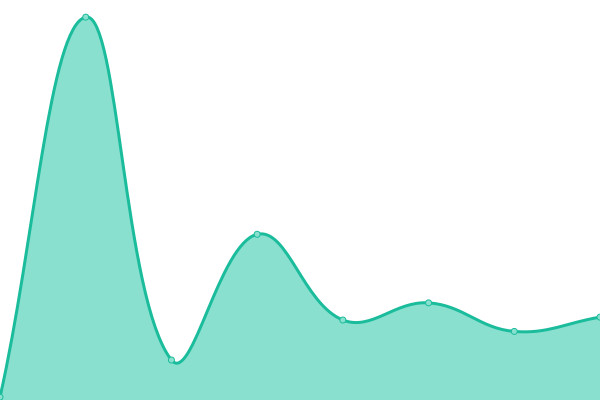
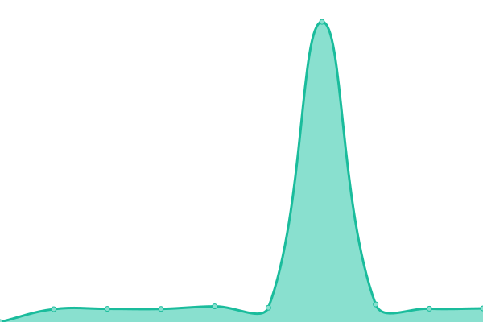

# [📈 Live Status](https://urvana.github.io/urvana-upptime): <!--live status--> **🟧 Partial outage**

This repository contains the open-source uptime monitor and status page for [URVANA.net](https://urvana.net), powered by [Upptime](https://github.com/upptime/upptime).

With [Upptime](https://upptime.js.org), you can get your own unlimited and free uptime monitor and status page, powered entirely by a GitHub repository. We use [Issues](https://github.com/urvana/urvana-upptime/issues) as incident reports, [Actions](https://github.com/urvana/urvana-upptime/actions) as uptime monitors, and [Pages](https://urvana.github.io/urvana-upptime) for the status page.

<!--start: status pages-->
<!-- This summary is generated by Upptime (https://github.com/upptime/upptime) -->
<!-- Do not edit this manually, your changes will be overwritten -->
<!-- prettier-ignore -->
| URL | Status | History | Response Time | Uptime |
| --- | ------ | ------- | ------------- | ------ |
|  [API Health](https://urvana.net/api/health) | 🟥 Down | [api-health.yml](https://github.com/urvana/urvana-upptime/commits/HEAD/history/api-health.yml) | 

 1475ms
     
 | 

<a href="https://urvana.github.io/urvana-upptime/history/api-health">99.69%</a>
    

|  [Landing page](https://urvana.net) | 🟩 Up | [landing-page.yml](https://github.com/urvana/urvana-upptime/commits/HEAD/history/landing-page.yml) | 

 536ms
     
 | 

<a href="https://urvana.github.io/urvana-upptime/history/landing-page">99.69%</a>
    

|  [Supabase bucket](https://adxcdfekysrkrquykrdy.supabase.co/storage/v1/object/public/assets/logo.png) | 🟥 Down | [supabase-bucket.yml](https://github.com/urvana/urvana-upptime/commits/HEAD/history/supabase-bucket.yml) | 

 1279ms
     
 | 

<a href="https://urvana.github.io/urvana-upptime/history/supabase-bucket">0.00%</a>
    

<!--end: status pages-->

[**Visit our status website →**](https://urvana.github.io/urvana-upptime)

## 📄 License

- Powered by: [Upptime](https://github.com/upptime/upptime)
- Code: [MIT](./LICENSE) © [URVANA.net](https://urvana.net)
- Data in the `./history` directory: [Open Database License](https://opendatacommons.org/licenses/odbl/1-0/)
